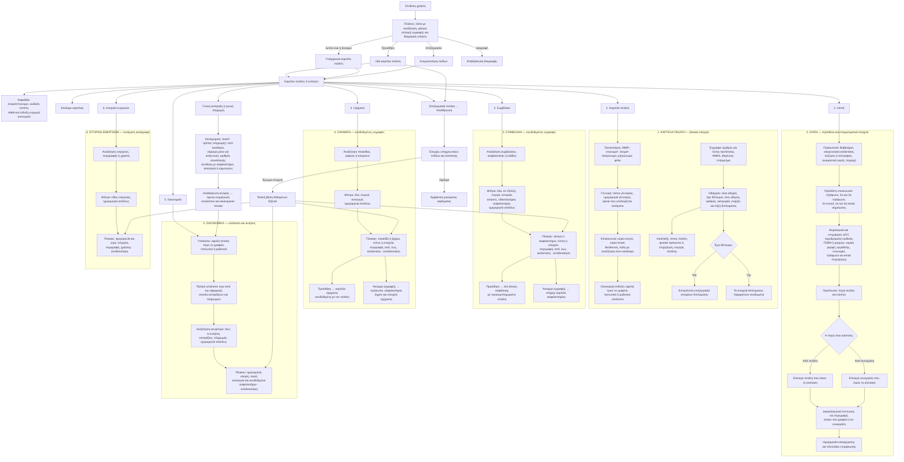

```mermaid
flowchart TB
    n1["Σύνδεση χρήστη"] --> n2["Πελάτες: λίστα με αναζήτηση, φίλτρα,<br/>επιλογή εγγραφής και διαχείριση στηλών"]
    n2 -->|Προσθήκη| n3["Νέα καρτέλα πελάτη"]
    n2 -->|Διπλό κλικ ή άνοιγμα| n4["Υπάρχουσα καρτέλα πελάτη"]
    n2 -->|Επεξεργασία| n5["Ενεργοποίηση πεδίων"]
    n2 -->|Διαγραφή| n6["Επιβεβαίωση διαγραφής"]
    n3 --> n7["Καρτέλα πελάτη: 6 ενότητες"]
    n4 --> n7
    n5 --> n7
    n7 --> n63["Κεφαλίδα: ονοματεπώνυμο, κωδικός πελάτη,<br/>ΑΦΜ και ένδειξη ενεργού/ανενεργού"]
    n7 --> n64["Κλείσιμο καρτέλας"]

    n7 --> n8["1. Καρτέλα πελάτη"]
    n7 --> n9["2. Λοιπά"]
    n7 --> n10["3. Συμβόλαια"]
    n7 --> n11["4. Οχήματα"]
    n7 --> n12["5. Οικονομικά"]
    n7 --> n13["6. Ιστορικό ενεργειών"]

    subgraph n14["1. ΚΑΡΤΕΛΑ ΠΕΛΑΤΗ — βασικά στοιχεία"]
      direction TB
      n15["Ταυτοποίηση: ΑΦΜ*, επώνυμο*, όνομα*,<br/>πατρώνυμο, μητρώνυμο, φύλο"]
      n16["Γέννηση: τόπος γέννησης, ημερομηνία γέννησης,<br/>ηλικία που υπολογίζεται αυτόματα"]
      n17["Επικοινωνία: κύριο κινητό, κύριο email,<br/>διεύθυνση, πόλη με αναζήτηση στον κατάλογο"]
      n18["Οικονομική ένδειξη: οφειλή προς το γραφείο,<br/>πιστωτικό ή μηδενικό υπόλοιπο"]
      n19["Έγγραφα: αριθμός και τύπος ταυτότητας,<br/>ΑΜΚΑ, ιθαγένεια, επάγγελμα"]
      n20["Οδήγηση: είναι οδηγός, έχει δίπλωμα, νέος οδηγός,<br/>αριθμός, κατηγορία, έναρξη και λήξη διπλώματος"]
      n21["Κατάταξη: τύπος πελάτη<br/>φυσικό πρόσωπο ή επιχείρηση, ενεργός πελάτης"]
      n20 --> n22{"Έχει δίπλωμα;"}
      n22 -->|Ναι| n23["Επιτρέπεται επεξεργασία στοιχείων διπλώματος"]
      n22 -->|Όχι| n24["Τα στοιχεία διπλώματος παραμένουν κλειδωμένα"]
    end
    n8 --> n15
    n15 --> n16 --> n17 --> n18
    n19 --> n20 --> n21

    subgraph n25["2. ΛΟΙΠΑ — πρόσθετα και επαγγελματικά στοιχεία"]
      direction TB
      n26["Προσωπικά: διαβατήριο, οικογενειακή κατάσταση,<br/>σύζυγος ή σύντροφος, ονομαστική εορτή, περιοχή"]
      n27["Πρόσθετη επικοινωνία: τηλέφωνο, 2ο και 3ο τηλέφωνο,<br/>2ο κινητό, 2ο και 3ο email, σημειώσεις"]
      n28["Φορολογικά και επιχείρηση: ΔΟΥ, ταχυδρομικός κώδικας,<br/>ΓΕΜΗ ή μητρώο, νομική μορφή, εργοδότης, επωνυμία,<br/>τηλέφωνο και email επιχείρησης"]
      n29["Προέλευση: πηγή πελάτη και ετικέτες"]
      n30{"Η πηγή είναι σύσταση;"}
      n31["Επιλογή πελάτη που έκανε τη σύσταση"]
      n32["Επιλογή συνεργάτη που έκανε τη σύσταση"]
      n33["Δικαιολογητικό έκπτωσης και περιγραφή,<br/>ανήκει στο γραφείο ή σε συνεργάτη"]
      n34["Ημερομηνία καταχώρισης και τελευταίας ενημέρωσης"]
      n29 --> n30
      n30 -->|Από πελάτη| n31
      n30 -->|Από συνεργάτη| n32
    end
    n9 --> n26
    n26 --> n27 --> n28 --> n29
    n31 --> n33
    n32 --> n33
    n33 --> n34

    subgraph n35["3. ΣΥΜΒΟΛΑΙΑ — συνδεδεμένες εγγραφές"]
      direction TB
      n36["Αναζήτηση συμβολαίου, ασφαλιστικής ή κλάδου"]
      n37["Φίλτρα: όλα, σε εξέλιξη, ενεργά, ιστορικά,<br/>αιτήσεις, ειδοποιητήρια, ασφαλιστήρια,<br/>ημερομηνία από/έως"]
      n38["Πίνακας: αίτηση ή ασφαλιστήριο, τύπος ή στοιχεία,<br/>περιγραφή, από, έως, κατάσταση · σελιδοποίηση"]
      n39["Προσθήκη → νέα αίτηση ασφάλισης<br/>με προσυμπληρωμένο πελάτη"]
      n40["Άνοιγμα εγγραφής → πλήρης καρτέλα ασφαλιστηρίου"]
      n36 --> n37 --> n38
      n38 --> n39
      n38 --> n40
    end
    n10 --> n36

    subgraph n41["4. ΟΧΗΜΑΤΑ — συνδεδεμένες εγγραφές"]
      direction TB
      n42["Αναζήτηση πινακίδας, μάρκας ή στοιχείων"]
      n43["Φίλτρα: όλα, ενεργά, ανενεργά,<br/>ημερομηνία από/έως"]
      n44["Πίνακας: πινακίδα ή όχημα, τύπος ή στοιχεία,<br/>περιγραφή, από, έως, κατάσταση · σελιδοποίηση"]
      n45["Προσθήκη → καρτέλα οχήματος<br/>συνδεδεμένη με τον πελάτη"]
      n46["Άνοιγμα εγγραφής → πρόσωπα, ασφαλιστήρια,<br/>ζημιές και στοιχεία οχήματος"]
      n42 --> n43 --> n44
      n44 --> n45
      n44 --> n46
    end
    n11 --> n42

    subgraph n47["5. ΟΙΚΟΝΟΜΙΚΑ — υπόλοιπο και κινήσεις"]
      direction TB
      n48["Υπόλοιπο: οφειλή πελάτη προς το γραφείο,<br/>πιστωτικό ή μηδενικό"]
      n49["Παλαιό υπόλοιπο πριν από την εφαρμογή,<br/>σύνολο εισπράξεων και πληρωμών"]
      n50["Αναζήτηση και φίλτρα: όλες οι κινήσεις,<br/>εισπράξεις, πληρωμές, ημερομηνία από/έως"]
      n51["Πίνακας: ημερομηνία, κίνηση, ποσό,<br/>αιτιολογία και συνδεδεμένο ασφαλιστήριο · σελιδοποίηση"]
      n48 --> n49 --> n50 --> n51
    end
    n12 --> n48

    n7 --> n52["Γενική είσπραξη ή γενική πληρωμή"]
    n52 --> n53["Καταχώριση: ποσό*, τρόπος πληρωμής* από κατάλογο,<br/>νόμισμα μόνο για ανάγνωση, αριθμός συναλλαγής,<br/>σύνδεση με ασφαλιστήριο, αιτιολογία ή σημειώσεις"]
    n53 --> n54["Αποθήκευση κίνησης → άμεση ενημέρωση<br/>υπολοίπου και οικονομικού πίνακα"]
    n54 --> n48

    subgraph n55["6. ΙΣΤΟΡΙΚΟ ΕΝΕΡΓΕΙΩΝ — αυτόματη καταγραφή"]
      direction TB
      n56["Αναζήτηση ενέργειας, περιγραφής ή χρήστη"]
      n57["Φίλτρα: είδος ενέργειας,<br/>ημερομηνία από/έως"]
      n58["Πίνακας: ημερομηνία και ώρα, ενέργεια,<br/>περιγραφή, χρήστης · σελιδοποίηση"]
      n56 --> n57 --> n58
    end
    n13 --> n56

    n7 --> n59["Επεξεργασία πελάτη → Αποθήκευση"]
    n3 --> n59
    n59 --> n60["Έλεγχος υποχρεωτικών πεδίων και σύστασης"]
    n60 -->|Έγκυρα στοιχεία| n61["Τοπική βάση δεδομένων SQLite"]
    n60 -->|Σφάλμα| n62["Εμφάνιση μηνύματος σφάλματος"]
    n61 --> n58
    n61 --> n38
    n61 --> n44
    n61 --> n51
```

